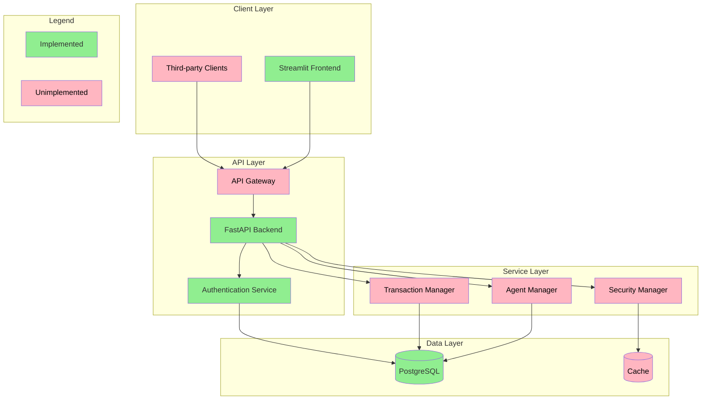

# Agent Bazaar

Agent Bazaar is a powerful, open-source platform that revolutionizes the way AI agents are distributed and accessed. Built with modern web technologies, it provides a seamless marketplace where developers can publish their AI agents and users can discover, purchase, and interact with them through an intuitive interface.

This platform bridges the gap between AI agent creators and users by offering:

- A centralized marketplace for discovering and sharing AI agents
- Secure user authentication and transaction handling
- Easy deployment and configuration options
- Extensible architecture for custom agent integration
- Modern, responsive web interface

Whether you're a developer looking to monetize your AI agents or a user seeking to leverage AI capabilities, Agent Bazaar provides the infrastructure and tools you need to participate in the growing AI agent ecosystem.

## System Architecture



### Service Definitions

#### Client Layer

- **Streamlit Frontend**: Implemented web interface for users to interact with the marketplace
- **Third-party Clients**: Unimplemented external applications that can integrate with the platform via API

#### API Layer

- **FastAPI Backend**: Implemented core API service handling all backend operations
- **Authentication Service**: Implemented JWT-based user authentication and authorization
- **API Gateway**: Unimplemented service for routing, rate limiting, and API management

#### Service Layer

- **Agent Manager**: Unimplemented service responsible for agent lifecycle, deployment, and execution
- **Transaction Manager**: Unimplemented service handling payments, billing, and marketplace transactions
- **Security Manager**: Unimplemented service managing access control, audit logging, and security policies

#### Data Layer

- **PostgreSQL**: Implemented primary database for storing application data
- **Cache**: Unimplemented caching layer for improved performance

## API Positioning

The Agent Bazaar API serves as:

- **Central Integration Hub**: Acts as the core orchestrator between agent providers, consumers, and the marketplace infrastructure

- **Service Gateway**: Provides standardized endpoints for agent registration, discovery, execution, and management

- **Security Layer**: Handles authentication, authorization, and secure communication between all platform components

- **Data Management Interface**: Manages all marketplace data including user profiles, agent metadata, transactions, and usage analytics

- **Business Logic Controller**: Implements marketplace rules, pricing mechanisms, and transaction workflows

- **Integration Point**: Offers standardized interfaces for:
  - Third-party agent integration
  - Payment processing systems
  - Authentication providers
  - Monitoring and analytics tools

- **Scalability Controller**: Manages load balancing, request routing, and resource allocation for agent execution

- **Version Management**: Handles API versioning and backward compatibility for stable ecosystem growth

- **Documentation Hub**: Serves as the single source of truth for all API specifications and integration guidelines

## Technology Stack

**Agent Bazaar** creates an extensible marketplace for AI agents using FastAPI, Streamlit, and PostgreSQL:

- [`FastAPI`](https://fastapi.tiangolo.com) - Modern Python web framework for building APIs
- [`SQLAlchemy`](https://www.sqlalchemy.org/) - The Python SQL Toolkit and Object-Relational Mapping Library
- [`Alembic`](https://alembic.sqlalchemy.org/en/latest/) - Database migrations
- [`Pydantic`](https://docs.pydantic.dev/) - Data validation and settings management using Python type annotations
- [`Streamlit`](https://streamlit.io) - Python library for creating web apps
- [`PostgreSQL`](https://www.postgresql.org) - The World's Most Advanced Open Source Relational Database
- [`Uvicorn`](https://www.uvicorn.org/) - ASGI server
- [`Poetry`](https://python-poetry.org/) - Dependency Management
- [`Docker`](https://www.docker.com/) - Container orchestration tool for defining multi-container applications
- [`Docker Compose`](https://docs.docker.com/compose/) - For easy deployment and development
- [`JWT`](https://jwt.io/) - JSON Web Tokens for secure authentication. Industry standard for secure authentication tokens
- [`Pytest`](https://docs.pytest.org/en/latest/) - Powerful Python testing framework

## Features

- 🏪 Agent marketplace interface
- 🔐 User authentication with JWT
- 🍪 Cookie based refresh token
- 🎨 Customizable Streamlit theming
- 🚀 FastAPI backend
- 🏬 PostgreSQL database
- 🚚 Easy running with docker compose

## Prerequisites

### Environment Setup

Create a `.env` file inside `src` directory:

```sh
touch .env
```

Inside `.env`, create the following variables:

```raw
# ------------- app settings -------------
APP_NAME="Agent Bazaar"
APP_DESCRIPTION="Your AI Agent Marketplace"
APP_VERSION="0.1"
CONTACT_NAME="Your name"
CONTACT_EMAIL="Your email"
LICENSE_NAME="MIT"

# ------------- database -------------
POSTGRES_USER="<database_user>"
POSTGRES_PASSWORD="<strong_password>"
POSTGRES_SERVER="<database_server>" # default "localhost", if using docker compose use "db"
POSTGRES_PORT=5432 # default "5432"
POSTGRES_DB="<database_name>"

# ------------- crypt -------------
SECRET_KEY="<result_of_openssl_rand_hex_32>"
ALGORITHM="<pick_an_algorithm>" # default HS256
ACCESS_TOKEN_EXPIRE_MINUTES="<minutes_until_token_expires>" # default 30
REFRESH_TOKEN_EXPIRE_DAYS="<days_until_token_expires>" # default 7

# ------------- admin -------------
ADMIN_NAME="<admin_name>"
ADMIN_EMAIL="<admin_email>"
ADMIN_USERNAME="<admin_username>"
ADMIN_PASSWORD="<strong_password>"

# ------------- environment -------------
ENVIRONMENT="local"
```

### Docker Compose (Recommended)

Ensure you have docker and docker compose installed, then run:

```sh
docker compose up
```

This will start:

- Web application (FastAPI + Streamlit)
- PostgreSQL database

### Manual Setup

1. Install poetry:

```sh
pip install poetry
```

2.Install dependencies:

```sh
poetry install
```

3.Start PostgreSQL (if not using existing instance):

```sh
docker run -d \
    -p 5432:5432 \
    --name postgres \
    -e POSTGRES_PASSWORD="<strong_password>" \
    -e POSTGRES_USER="<database_user>" \
    postgres
```

4.Run the application:

Run database migrations first:

```sh
poetry run alembic upgrade head
```

Then start the application: 

```sh
poetry run uvicorn src.app.main:app --reload
```

## Usage

### Accessing the Application

- Frontend (Streamlit): http://localhost:8501
- API Documentation: http://localhost:8000/docs

### Agent Configuration

Agents are configured in `src/app/streamlit/config.yaml`:

```yaml
agents:
  - name: Agent Name
    image_path: ./images/agent_image.png
```

### Authentication

The application uses JWT authentication:

- Login/Register through the Streamlit interface
- API endpoints protected with JWT tokens
- Refresh tokens handled via secure cookies

## Development

### Project Structure

```raw
├── src/
│   ├── app/
│   │   ├── api/            # API endpoints
│   │   ├── core/           # Core functionality
│   │   ├── models/         # Database models
│   │   ├── schemas/        # Pydantic schemas
│   │   └── streamlit/      # Streamlit frontend
│   └── migrations/         # Database migrations
├── docker-compose.yml
├── Dockerfile
└── pyproject.toml
```

### Running Tests

```sh
poetry run pytest
```

## License

This project is licensed under the MIT License - see the [LICENSE.md](LICENSE.md) file for details.
